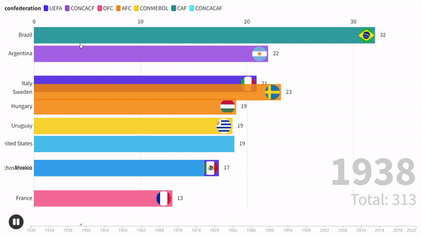

<h1 align="center">World Cup Data Analysis</h1>

An analysis of data from the FIFA World Cup. The graph shows the goals accumulated by each team throughout the cups.

  

## 🚀 Technologies

- Python
- Jupyter
- Flourish

## 📝 License

  

 
